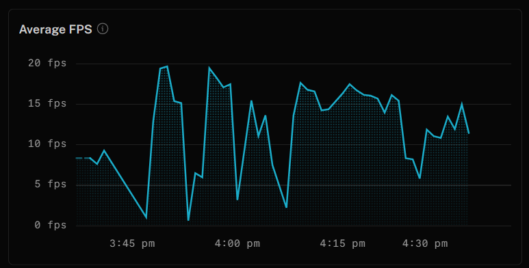
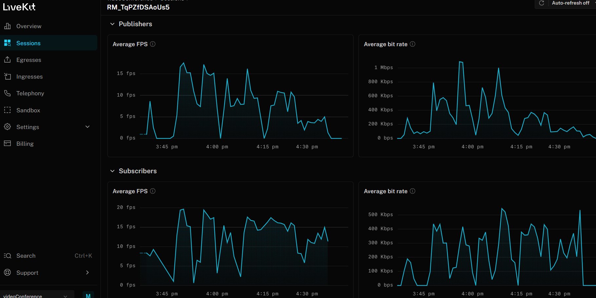
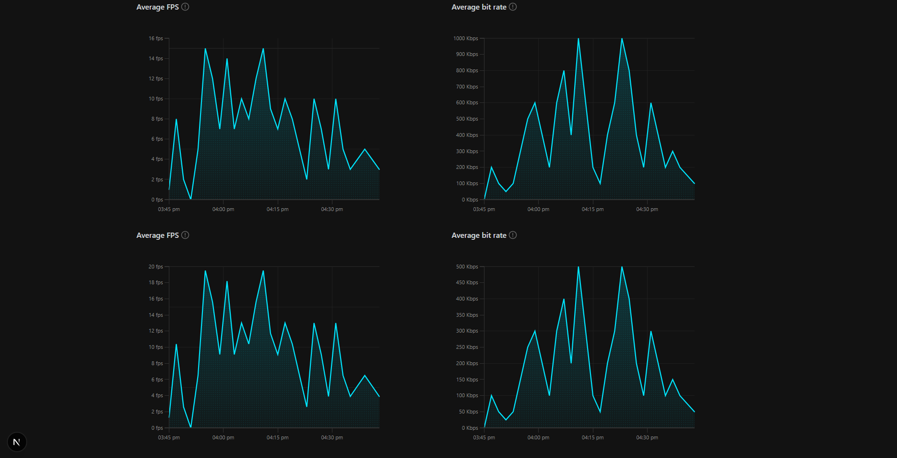

# Visx Dashboard

A collection of reusable and customizable chart components built with [Visx](https://airbnb.io/visx/) for data visualization. These components are designed to create visually appealing dashboards for personal and professional use.

## Features

- **Reusable Components**: Easily integrate charts into your projects.
- **Customizable Styles**: Tailor the appearance of charts to match your branding.
- **Interactive Tooltips**: Provide detailed information on hover.
- **Responsive Design**: Charts adapt to different screen sizes.
- **Supports Multiple Chart Types**: Line charts, area charts, and more.

## Sample Graph

Below is an example of a graph created using the `PerformanceChart` component:

## Inspiration

From Livekit Cloud

## Current Level

98% Match with Inspiration

